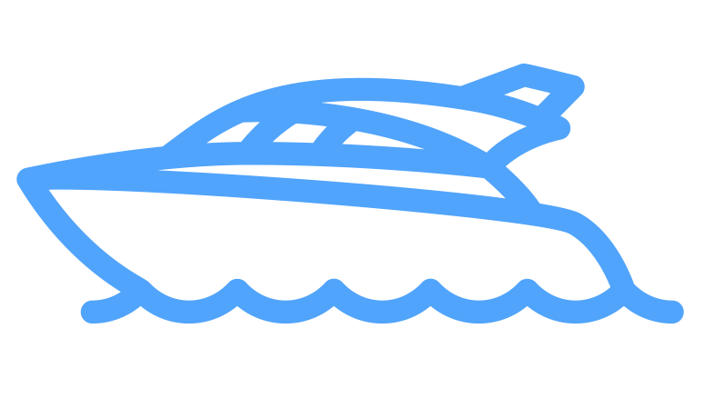

# Markdown Doc 1

Remember these docs have to be commited in order to appear!

## Markdown Doc 2

[Link to Website](https://github.com/snipem/monako.git)

Ihr naht euch wieder, schwankende Gestalten! Die früh sich einst dem trüben
Blick gezeigt. Versuch’ ich wohl euch diesmal fest zu halten? Fühl’ ich
mein Herz noch jenem Wahn geneigt? Ihr drängt euch zu! nun gut, so mögt ihr
walten. Wie ihr aus Dunst und [Nebel](https://de.wikipedia.org/wiki/Nebel) um mich steigt. Mein Busen fühlt sich
jugendlich erschüttert. Vom Zauberhauch der euren Zug umwittert. Ihr bringt mit
euch die Bilder froher Tage. Und manche liebe Schatten steigen auf Gleich einer
alten, halbverklungnen Sage. Kommt erste Lieb’ und Freundschaft mit herauf Der
Schmerz wird neu, es wiederholt die Klage. Des Lebens labyrinthisch irren Lauf,
Und nennt die Guten, die, um schöne Stunden Vom Glück getäuscht, vor mir
hinweggeschwunden.



### Markdown Doc 3

Ihr naht euch wieder, schwankende Gestalten! Die früh sich einst dem trüben
Blick gezeigt. Versuch’ ich wohl euch diesmal fest zu halten? Fühl’ ich
mein Herz noch jenem Wahn geneigt? Ihr drängt euch zu! nun gut, so mögt ihr
walten. Wie ihr aus Dunst und Nebel um mich steigt. Mein Busen fühlt sich
jugendlich erschüttert. Vom Zauberhauch der euren Zug umwittert. Ihr bringt mit
euch die Bilder froher Tage. Und manche liebe Schatten steigen auf Gleich einer
alten, halbverklungnen Sage. Kommt erste Lieb’ und Freundschaft mit herauf Der
Schmerz wird neu, es wiederholt die Klage. Des Lebens labyrinthisch irren Lauf,
Und nennt die Guten, die, um schöne Stunden Vom Glück getäuscht, vor mir
hinweggeschwunden.

#### Markdown Doc 4

```go
	if err != nil {
		if len(files) == 0 {
			t.Errorf("No files checked out")
		}
    }
```

Ihr naht euch wieder, schwankende Gestalten! Die früh sich einst dem trüben
Blick gezeigt. Versuch’ ich wohl euch diesmal fest zu halten? Fühl’ ich
mein Herz noch jenem Wahn geneigt? Ihr drängt euch zu! nun gut, so mögt ihr
walten. Wie ihr aus Dunst und Nebel um mich steigt. Mein Busen fühlt sich
jugendlich erschüttert. Vom Zauberhauch der euren Zug umwittert. Ihr bringt mit
euch die Bilder froher Tage. Und manche liebe Schatten steigen auf Gleich einer
alten, halbverklungnen Sage. Kommt erste Lieb’ und Freundschaft mit herauf Der
Schmerz wird neu, es wiederholt die Klage. Des Lebens labyrinthisch irren Lauf,
Und nennt die Guten, die, um schöne Stunden Vom Glück getäuscht, vor mir
hinweggeschwunden.


### Mermaid Example


sequenceDiagram
    Alice->>Bob: Hello Bob, how are you?
    alt is sick
        Bob->>Alice: Not so good :(
    else is well
        Bob->>Alice: Feeling fresh like a daisy
    end
    opt Extra response
        Bob->>Alice: Thanks for asking
    end

